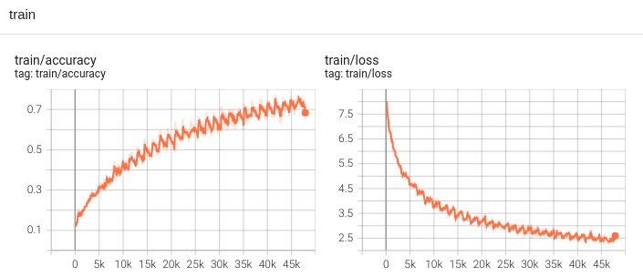

# Transformer

## 紹介

TransformerをPytorchで実装しています。

### 参照論文

* [Decision Transformer: Outperforming the Atari Human Benchmark](https://arxiv.org/abs/1706.03762)


## 実行

```
python3 trainer.py
```
### 設定

* データ：davidstap/ted_talks
* ステップ数：30

## 結果

### 訓練
#### 正確さ、損失

 

### 検証
#### 推論（100ステップごと）
入力：英語、出力：日本語

```validation.txt
2024/06/22 12:12:26 ----------------
So the pieces are, not only the training of the lawyers, but us finding a way to systematically implement early access to counsel, because they are the safeguard in the system for people who are being tortured.

2024/06/22 12:13:46 ----------------
So a few game days later it came to light that we found out this major country was planning a military offensive to dominate the entire world.
ののののののののののののががののののののののを
2024/06/22 12:15:09 ----------------
And she made a cartogram, which is basically a distorted map based on what American television news casts looked at for a month.
がのがががががががががががががが
2024/06/22 12:16:27 ----------------
Now, suddenly we had to support city leagues.
― ― ― ― ― ― ― ―
2024/06/22 12:17:46 ----------------
It was started with about 12 of my friends, people that I had known for years that were writers in the neighborhood.
― ― ― ― ― ― ― ― ― ― ― ―
2024/06/22 12:19:04 ----------------
The teachers that we work with — and everything is different to teachers — they tell us what to do.
素晴らしいは、 ― ― ― ― ― ― ― ― ― 
2024/06/22 12:20:22 ----------------
Anyone living in that house can tell the time just by the smell.
もっとが、この、この、この、この

...

2024/06/22 22:20:56 ----------------
But again, then we have to talk about well-being in a larger context.
ですがその後もっと大きなコンテキストにおいて幸福について語らなくてはなりません
2024/06/22 22:22:13 ----------------
So we do a lot of things.
いろんなことをやっています
2024/06/22 22:23:33 ----------------
These people have no escape at all, and as we take in such a difficult subject, it's important to note that slavery, including sex trafficking, occurs in our own backyard as well.
誰もがそこから逃げ出すことができ困難も出てくるでしょうこうした問題は性産業も含めてその問題なのです例えば裏庭にいる我々の手の中にもあって
2024/06/22 22:24:52 ----------------
But let me introduce you to the one who is most at risk here.
ここにいる最も危険な場所にいる1人の話をします
2024/06/22 22:26:08 ----------------
I met these boys at five in the morning, when they were hauling in the last of their nets, but they had been working since 1 a.m.
朝5時に少年達に会いました蚊帳の最後の端でガムをかぶっていたのですが、彼らは1時から働いていました。
2024/06/22 22:27:25 ----------------
He began renting out motorbikes to local residents who couldn't normally afford them.
普段は無給休暇で地元の住民を借りる電気モーターを借り
2024/06/22 22:28:46 ----------------
I was raised in a country that has been destroyed by decades of war.
数十年が戦争で破壊された国に生まれ育った
2024/06/22 22:30:03 ----------------
OK, next, clubbing.
次はクラブです
```